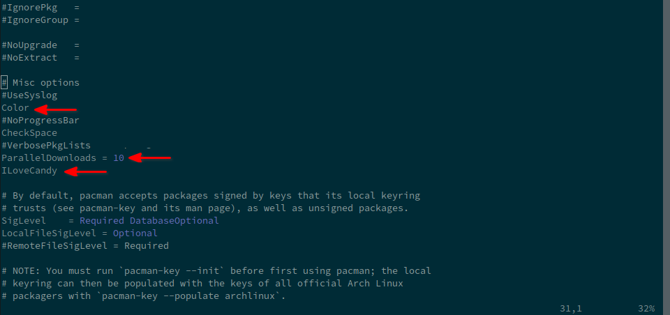
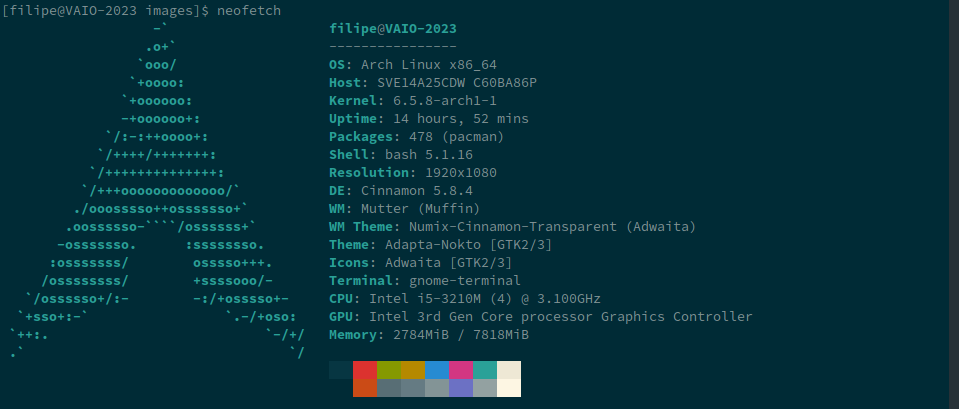
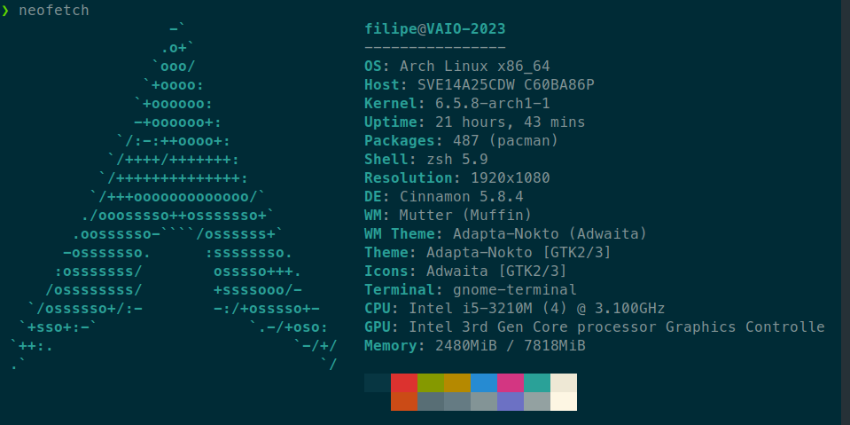

# my-arch-stuff_journal

<!--toc:start-->
- [my-arch-stuff_journal](#my-arch-stuffjournal)
    - [20231025_0810: Well... I've done a bunch of stuff 'till here... I'll try to describe:](#202310250810-well-ive-done-a-bunch-of-stuff-till-here-ill-try-to-describe)
    - [20231025_1522: Continuing the description:](#202310251522-continuing-the-description)
    - [20231025_1542: After reboot with the USB stick burned:](#202310251542-after-reboot-with-the-usb-stick-burned)
    - [20231026_0637: First login:](#202310260637-first-login)
<!--toc:end-->

### 20231025_0810: Well... I've done a bunch of stuff 'till here... I'll try to describe:
- I've entered in archlinux oficial [page](https://archlinux.org/).
- Downloaded, from one of [BR mirrors](https://linorg.usp.br/archlinux/iso/), the "iso" file.
- Doing it from a terminal, it will be something like:
```zsh
$ wget https://linorg.usp.br/archlinux/iso/2023.10.14/archlinux-2023.10.14-x86_64.iso
```

- Then, checking the downloaded iso file:
```zsh
// checksum with b2
$ wget https://linorg.usp.br/archlinux/iso/2023.10.14/b2sums.txt
$ b2sum -c b2sums.txt
archlinux-2023.10.14-x86_64.iso: OK
// failed checksums
b2sum: archlinux-x86_64.iso: No such file or directory
archlinux-x86_64.iso: FAILED open or read
b2sum: archlinux-bootstrap-2023.10.14-x86_64.tar.gz: No such file or directory
archlinux-bootstrap-2023.10.14-x86_64.tar.gz: FAILED open or read
b2sum: archlinux-bootstrap-x86_64.tar.gz: No such file or directory
archlinux-bootstrap-x86_64.tar.gz: FAILED open or read
b2sum: WARNING: 3 listed files could not be read*

// checksum with sha256
$ wget https://linorg.usp.br/archlinux/iso/2023.10.14/sha256sums.txt
$ sha256sum -c sha256sums.txt
archlinux-2023.10.14-x86_64.iso: OK
// failed checksums
sha256sum: archlinux-x86_64.iso: No such file or directory
archlinux-x86_64.iso: FAILED open or read
sha256sum: archlinux-bootstrap-2023.10.14-x86_64.tar.gz: No such file or directory
archlinux-bootstrap-2023.10.14-x86_64.tar.gz: FAILED open or read
sha256sum: archlinux-bootstrap-x86_64.tar.gz: No such file or directory
archlinux-bootstrap-x86_64.tar.gz: FAILED open or read
sha256sum: WARNING: 3 listed files could not be read
```

- To be honest, I've got curios with the other "checksum"s, so gived a try on the PGP signature check, to do so, I've used **[sq](https://man.archlinux.org/man/sq.1#DESCRIPTION)** - "A command-line frontend for Sequoia, an implementation of OpenPGP".
```zsh
// getting the signature file from iso:
$ wget https://linorg.usp.br/archlinux/iso/2023.10.14/archlinux-2023.10.14-x86_64.iso.sig

// looking up for certificates in a "Web Key Directory" and wrinting it to a FILE:
$ sq wkd get pierre@archlinux.org -o release-key.pgp

// verifying the signature:
$ sq verify --signer-file release-key.pgp --detached archlinux-2023.10.14-x86_64.iso.sig archlinux-2023.10.14-x86_64.iso
```

### 20231025_1522: Continuing the description:
- After download and check the integrity of the arch "iso" file, time to burn a USB stick with it.
- After some googling, I went through 3 steps (1) erase all data from the USV stick, (2) format it, (3) copy the iso file.

1. To erase all data, I did:
```zsh
$ sudo fdisk /dev/sdb
Command (m for help)\: p => to list all partitions
Command (m for help)\: d => to delete all partitions
Command (m for help)\: n => to add a new partition, following the next steps to add a unique, full and primary partition
Command (m for help)\: w => to write the changes
```

2. To format it: `$ sudo mkfs.vfat -F 32 /dev/sdb1 -n "archlinux"` .

3. And finally to copy iso file into the USB stick: `$ sudo dd bs=4M if=archlinux-2023.10.14-x86_64.iso of=/dev/sdb status=progress oflag=sync` .


### 20231025_1542: After reboot with the USB stick burned:
- Connect to internet using "iwctl" (Internet wireless control utility)\: `iwctl` (in my case).
- `[iwd]# device list`
- `[iwd]# station <device-name> connect <Wi-Fi>`
- `[iwd]# password...`
- Then, I pretty much follow this tutorial: [Instale o Arch Linux sem SOFRER! - Tutorial COMPLETO (e rápido, sério!)](https://www.youtube.com/watch?v=_nDqRToEtpo).
- The options I've chosen (in my particular case) was.

| Parameter                 | Value                         | Detail                                             |
| ------------------------- | ----------------------------- | -------------------------------------------------- |
| Archintall language       | English (100%)                | N/A                                                |
| Mirrors                   | Defined                       | Mirror regions: Brazil                             |
| Locales                   | Defined                       | Keyboard layout: us                                |
| -                         | -                             | Locale language: en_US                             |
| -                         | -                             | Locale encoding: UTF-8                             |
| Disk configuration        | Use a best-effort default ... | N/A                                                |
| Disk encryption           | -                             | N/A                                                |
| Bootloader                | Systemd-boot                  | N/A                                                |
| Swap                      | False                         | N/A                                                |
| Hostname                  | VAIO-2013                     | N/A                                                |
| Root password             | -                             | N/A                                                |
| User account              | 1 User(s)                     | Configured to use "sudo" (included in group WHELL) |
| Profile                   | Desktop                       | Profile: Cinnamon                                  |
| Profile                   | -                             | Graphics driver: Intel (open-source)               |
| Profile                   | -                             | Greeter: lightdm-gtk-greeter                       |
| Audio                     | Pipewire                      | N/A                                                |
| Kernel                    | linux                         | N/A                                                |
| Additional packages       | Defined                       | neofetch firefox                                   |
| Network configuration     | Use NetworkManager ...        | N/A                                                |
| Timezone                  | America/Sao_Paulo             | N/A                                                |
| Automatic time sync (NTP) | True                          | N/A                                                |

- For me, the trick here was the graphics driver, I've tested couple of combinations of profiles and graphics drivers. As I'm using an old laptop here, a VAIO from 2013, I've struggled a bit to make the HDMI out work.

### 20231026_0637: First login:
- Changed the configs from "/etc/pacman.conf".

- Intalled [yay](https://github.com/Jguer/yay).
```zsh
$ cd /tmp
$ mkdir yay
$ pacman -S --needed git base-devel && git clone https://aur.archlinux.org/yay.git && cd yay && makepkg -si
```
- Then, installed Chrome and remove Firefox.
- My "objective" here is to have a minimalist GUI interface for Arch but with some small pleasures. To achieve that I wouldn't like to have more than 500 packages installed... Considering that in my Arch@WSL2 I have less than 200 packages.
- At this point I'm with:

- Then, I pretty much follow this tutorial: [O Melhor Setup Dev com Arch e WSL2](https://www.youtube.com/watch?v=sjrW74Hx5Po&t=2328s) --- from zsh installation: https://www.youtube.com/watch?v=sjrW74Hx5Po&t=1988s.
- And, end up with:


### 20240306_0814: Desktop Env, by my own:
- I went through archinstall again, but this time using the "minimal" profile.
- So, instead go through the [First login section](#202310260637-first-login), I did the follow...
- Installed vim, git.
- Inslalled asdf.
- Installed python and golang (with asdf).
- Changed the configs of pacman and installed yay as the Fisrt login section.
- Now, building into my Desktop Env...
    - Installed xorg packages
    - Installed the Display Manager LightDM and the Greeter's packages
    - Installed the Desktop Env: cinnamon
    - Enabled the lightdm service
- At this point I've 497 packages, and a "fucntional" Desktop Env. - what is a bit frustrating, 'cause it's more than the "archinstall" aproach.
- Anyways, I've learned more about X servers, displays managers, and desktop environments...


